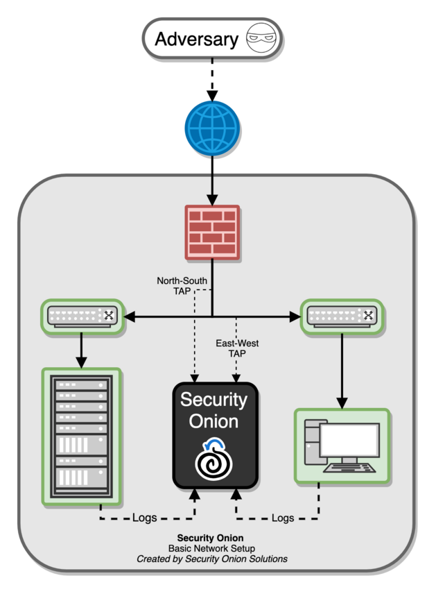
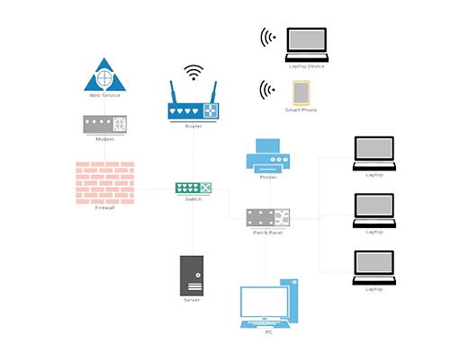
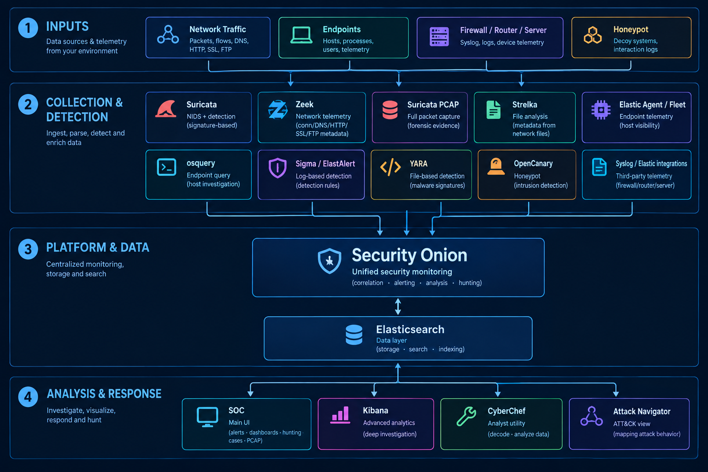
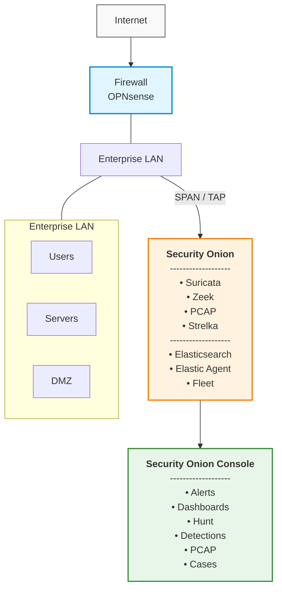
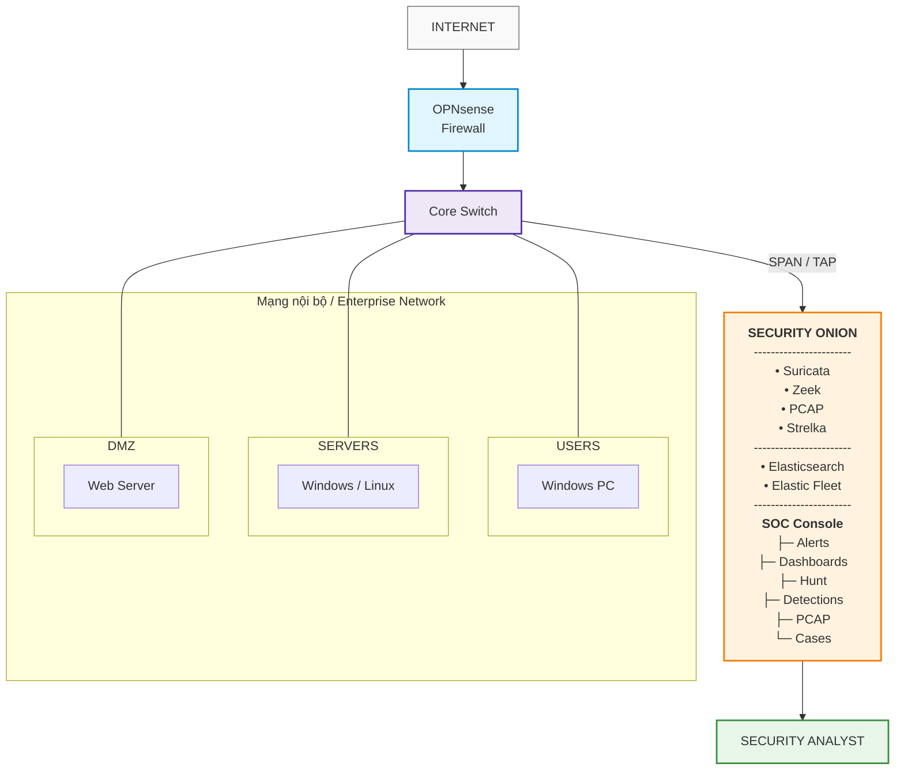

# Security Onion 

> Nhan_laptop
> Lvy-H
> Supershy

## Security Onion là gì ? 

Security Onion hiện được mô tả chính thức là một nền tảng mở dành cho:
- network visibility.
- host visibility
- intrusion detection honeypots
- log management
- case management



Nó kết hợp các nguồn telemetry rồi đưa chúng vào Elasticsearch (là một công cụ tìm kiếm và phân tích dữ liệu phân tán mã nguồn mở dựa trên nền tảng Apache Lucene) và cung cấp các giao diện phục vụ detection, dashboards, threat hunting và investigation.

Security Onion có thể thực hiện nhiều chức năng SIEM (Security Information and Event Management là giải pháp công nghệ quản lý thông tin và sự kiện bảo mật, giúp doanh nghiệp thu thập, phân tích dữ liệu và phát hiện các mối đe dọa an ninh mạng), nhưng về bản chất nó mạnh đặc biệt ở network security monitoring + investigation hơn là một SIEM tổng quát cho mọi loại nghiệp vụ doanh nghiệp.

## Motivation 
Một mạng doanh nghiệp nhỏ có thể nhìn như sau:



Vấn đề là mỗi thiết bị tạo dữ liệu ở nơi khác nhau.

| Pain point                       | Vấn đề thực tế                                                |
| -------------------------------- | ------------------------------------------------------------- |
| Log phân tán                     | Firewall, Windows, Linux, IDS mỗi nơi một log                 |
| Alert thiếu context              | IDS nói “suspicious traffic” nhưng chưa biết host đang làm gì |
| Traffic mã hóa                   | Network sensor có thể không nhìn thấy nội dung                |
| Alert fatigue                    | Quá nhiều detection, khó biết cái nào quan trọng              |
| Không có packet evidence         | Có alert nhưng khó chứng minh chuyện gì đã xảy ra             |
| Không phát hiện được hành vi mới | Signature-only không đủ                                       |
| Không có investigation workflow  | Analyst phát hiện nhưng không có nơi quản lý case             |


Security Onion giải quyết bằng cách kết hợp network telemetry, endpoint telemetry, PCAP, detections và case management.

## Technology stack 


| Technology                        | Vai trò               | Bạn sẽ chứng minh gì?                |
| --------------------------------- | --------------------- | ------------------------------------ |
| **Security Onion**                | Nền tảng trung tâm    | Unified security monitoring          |
| **Suricata**                      | NIDS + detection      | Signature-based detection            |
| **Zeek**                          | Network telemetry     | Connection/DNS/HTTP/SSL/FTP metadata |
| **Suricata PCAP**                 | Full packet capture   | Forensic evidence                    |
| **Elasticsearch**                 | Storage/search/index  | SIEM data layer                      |
| **Elastic Agent / Fleet**         | Endpoint telemetry    | Host visibility                      |
| **osquery**                       | Endpoint query        | Host investigation                   |
| **Strelka**                       | File analysis         | Metadata từ file network             |
| **Sigma / ElastAlert**            | Detection             | Log-based detection                  |
| **YARA**                          | File detection        | File-based detection                 |
| **OpenCanary**                    | Honeypot              | Intrusion detection honeypot         |
| **Syslog / Elastic integrations** | Third-party telemetry | Firewall/router/server visibility    |
| **SOC**                           | Main UI               | Alerts/Dashboards/Hunt/Cases/PCAP    |
| **Kibana**                        | Advanced analytics    | Deep investigation                   |
| **CyberChef**                     | Analyst utility       | Decode/analyze data                  |
| **Attack Navigator**              | ATT&CK view           | Mapping attack behavior              |

Endpoint visibility dùng Elastic Agent + Elastic Fleet, trong đó Osquery có thể dùng để thực hiện live/scheduled queries.

## Kiến trúc hoạt động 


Security Onion yêu cầu interface dùng để sniff traffic phải dành riêng cho sniffing và không có IP address; management interface mới là interface có IP.

## Architecture  dành cho project 




## Scenarios -usecase 
### Scenario 1 — Network Scanning
```
Kali
 │
 │ scan
 ▼
Enterprise network
 │
 ▼
Security Onion
 ├── Suricata alert
 ├── Zeek connection logs
 └── PCAP
```
Mục tiêu:
```
Chứng minh NIDS có thể phát hiện reconnaissance và analyst có thể pivot từ alert → network metadata → PCAP.
```

ATT&CK mapping có thể dùng:
- T1046 — Network Service Scanning

### Scenario 2 — Authentication Attack Simulation

```
Kali
   │
   │ repeated failed login
   ▼
Ubuntu Server
   │
   ├── auth log
   └── network connection
          │
          ▼
     Security Onion
```

Kiểm tra : 
- NETWORK VIEW
- HOST VIEW

Endpoint được quản lý bằng Elastic Agent/Fleet và có thể thu thập system authentication logs.

attack vector : 
```
source.ip
       ↓
failed login
       ↓
host
       ↓
user
       ↓
timeline
       ↓
case
```
### Scenario 3 — Suspicious Web Activity
```
Kali / Client
       │
       ▼
     DMZ
       │
   Web Server
       │
       ▼
 Security Onion
 ```

Tạo một request không phá hoại tới web server.

Security Onion có thể cho thấy: 
```
Suricata
   ↓
Alert

Zeek
   ↓
HTTP metadata

PCAP
   ↓
Packet evidence
```

Sau đó:
```
Alert
  ↓
Dashboards
  ↓
Hunt
  ↓
PCAP
  ↓
Case
```
### Scenario 4 — Endpoint Detection
Windows endpoint cài Elastic Agent.
```
Windows
   │
   ├── Process
   ├── Network
   ├── File
   ├── Registry
   └── Security logs
          │
          ▼
     Elastic Agent
          │
          ▼
      Security Onion
```

có thể tạo một harmless test event, chẳng hạn một hành vi PowerShell có chủ ý trong lab, rồi tạo Sigma detection.

- Security Onion hỗ trợ Sigma detections thông qua Detections interface.

Điều này chứng minh:

- Threat Hunting không chỉ dựa vào network packet.


### Scenario 5 — File Transfer + PCAP Investigation

```
Host A
  │
  │ benign test file
  ▼
Host B
  │
  ▼
Network traffic
  │
  ├── Zeek metadata
  ├── Suricata
  └── PCAP
```
Sau đó analyst:
```
Hunt
 ↓
identify connection
 ↓
pivot to PCAP
 ↓
inspect stream
 ↓
document evidence
 ↓
Case
```

Security Onion 3 dùng Suricata để ghi full packet capture và SOC cho phép pivot từ Alerts/Dashboards/Hunt sang PCAP.

### Scenario 6 — Honeypot

```
              DMZ
               │
        ┌──────▼──────┐
        │ OpenCanary  │
        │ Honeypot    │
        └──────┬──────┘
               │
               ▼
         Security Onion
               │
             Alert
```

Security Onion có Intrusion Detection Honeypot dựa trên OpenCanary; kết nối tới các service honeypot có thể tạo alert.

### Standalone Mode with Dual NIC
### pfSense Firewall Integration
### Internal Network Deployment
### Threat Hunting workflow
Phần này phải được xem là một chapter riêng, không phải phụ của IDS.

Official Security Onion mô tả Hunt là interface được thiết kế riêng cho threat hunting, với query mặc định tập trung hơn vào các hoạt động cần điều tra.

```
                ALERT
                  │
                  ▼
              Analyst
                  │
        ┌─────────┴─────────┐
        │                   │
    What happened?      Is it isolated?
        │                   │
        ▼                   ▼
       Hunt             Correlate
        │                   │
        └─────────┬─────────┘
                  │
                  ▼
                 PCAP
                  │
                  ▼
               Evidence
                  │
                  ▼
                CASE
```
DS tells us that something suspicious happened. Threat hunting helps us determine whether the event is isolated, what else happened around it, and whether the same behavior exists elsewhere.
### Case Management

Cases cho phép analyst lấy dữ liệu từ Alerts, Dashboards và Hunt rồi chuyển thành investigation case, assign analyst, thêm comments, attachments và observables.
```
CASE-001
Suspicious Network Scanning

CASE-002
Repeated Authentication Failures

CASE-003
Suspicious Web Activity
```
Mỗi case:

```
Title
Severity
Affected Host
Source IP
Destination IP
Timestamp
Detection
Evidence
PCAP
Investigation
Conclusion
```

## Combine 
| Scenario | Attack Technique | MITRE ATT&CK ID | Security Onion Data Source | Primary Detection / Artifact |
| :--- | :--- | :--- | :--- | :--- |
| **1. Reconnaissance** | Network Service Scanning | `T1046` | Zeek (`conn.log`), Suricata | NIDS Alert + High Volume SYN Packets |
| **2. Auth Attack** | Brute Force / Password Spray | `T1110` | Elastic Agent (Sysmon/Auth log) | Event ID 4625 (Windows) / `sshd` failure |
| **3. Web Attack** | Exploit Public-Facing App | `T1190` | Zeek (`http.log`), Suricata | HTTP 4xx/5xx errors, SQLi/XSS Payloads |
| **4. Endpoint Execution** | Command and Scripting Interpreter (PowerShell) | `T1059.001` | Elastic Agent (Process Tracking) | Event ID 4688 / Sysmon Event ID 1 |
| **5. Exfiltration** | Exfiltration Over Unencrypted Non-Application Protocol | `T1048.003` | Zeek (`files.log`), Suricata, PCAP | Extracted File Hash + PCAP Stream |
| **6. Honeypot** | Honeypot Trigger | `DS0028` | OpenCanary Integration | Unauthorized Service Connection Alert |

## References 


- https://docs.securityonion.net/en/3/main/introduction
- https://viblo.asia/p/elasticsearch-la-gi-1Je5E8RmlnL
- https://aws.amazon.com/vi/what-is/elasticsearch/
- https://www.viettelidc.com.vn/tin-tuc/siem-la-gi
- https://thietbimanggiare.com/tin-tuc/mo-hinh-mang-cho-doanh-nghiep.html